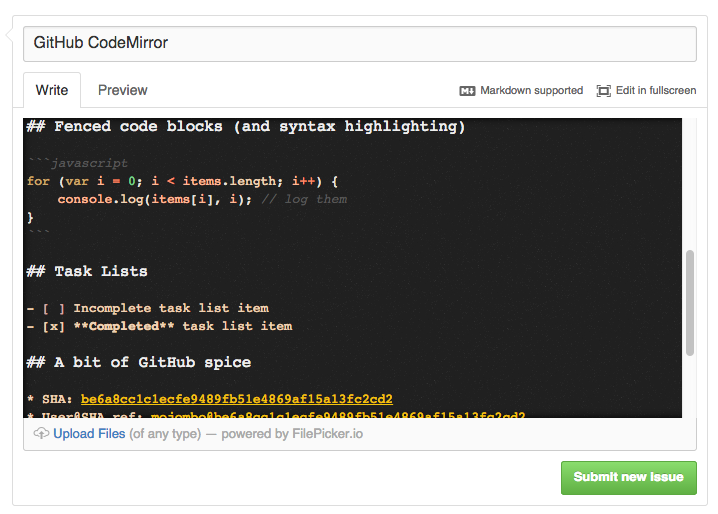
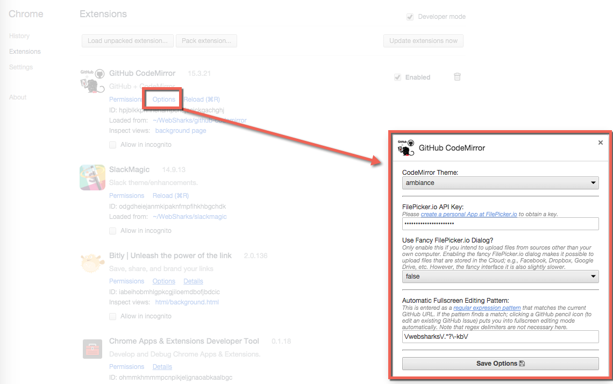

## GitHub CodeMirror


This replaces the default GitHub Issue textarea with a [CodeMirror running in GFM mixed mode](http://codemirror.net/mode/gfm/). This works for a New Issue and for Comments on an existing Issue.

### GitHub CodeMirror Features

- Full-featured code editor operating in [GFM mixed mode](http://codemirror.net/mode/gfm/).
- Syntax highlighting for fenced code blocks that include a language specifier.
- [Keyboard shortcuts](http://codemirror.net/doc/manual.html#commands) for text editing commands.
- [Search/replace](http://codemirror.net/demo/search.html) functionality (including regex).
- The ability to use the Tab key, or Shift-Tab (powered by CodeMirror).
- Supports the `R` key shortcut at GitHub; for quick replies to existing Issues.
- Supports a true fullscreen editing mode. Use `F11` to toggle or click the fullscreen link.
- Adds the ability to upload files of _any_ type (not just images). This is powered by FilePicker.io. Also works in fullscreen mode.
   **Note:** When you click the file upload link for the first time, you will be asked for your [FilePicker.io](https://www.filepicker.io/) key. Please visit [FilePicker.io](https://www.filepicker.io/), signup, and create an App to acquire your key. You only need to enter this one time.
- Support for New Issues, Issue Comments, Inline Commit Comments, Pull Requests, Inline PR Comments, and Gist Comments.



### Installation Instructions

- Clone or download the `000000-dev` branch.

	```
	git clone https://github.com/websharks/github-codemirror
	git checkout 000000-dev
	```

- Now open [Google Chrome](http://www.google.com/chrome/) and go to: `chrome://extensions/`.
- Check the "Developer Mode" box on the top right-hand side of your screen.
- Click the **Load Unpacked Extension** button at the top of your screen.
- Choose the `github-codemirror` folder and you're set.
- Now just reload the GitHub web interface.

### How to Change Extension Options

- See: <chrome://extensions/>
- Find the GitHub CodeMirror extension in the list.
- Click the "options" link.

